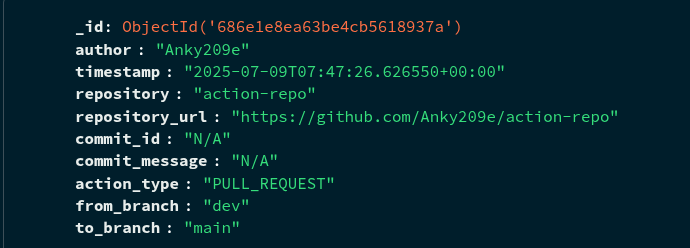

# 🚀 GitHub Webhook Dashboard

A real-time dashboard built using **Flask**, **MongoDB**, and **Vanilla JS** to visualize GitHub webhook events like `push`, `pull_request`, and `merge`.

This project is a part of the **TechStaX Developer Assignment**.


---

##  Repositories

- **`webhook-repo`** – Flask backend with MongoDB + HTML dashboard to view events.
- **`action-repo`** – Dummy GitHub repo used to trigger events (`push`, `PR`, `merge`).

---
## Data in mongodb compass


##  Tech Stack

- Python 3.9+
- Flask
- MongoDB (Docker or local)
- HTML + CSS + JS
- Ngrok (for public webhook exposure)

---

##  Setup Instructions

### 1. Clone Repositories

```bash
git clone https://github.com/anky209e/webhook-repo.git
git clone https://github.com/anky209e/action-repo.git
```
 
### 2. Create and Activate Virtual Environment
```bash
cd webhook-repo
python3 -m venv venv
source venv/bin/activate
```
### 3. Install Dependencies
```bash
pip install flask pymongo
```
### 4. Start MongoDB (via Docker)
```bash
docker run -d -p 27017:27017 --name mongo mongo
```
### 5. Run Flask App
```bash
python app.py
```
### 6. Expose Flask App Using Ngrok
```bash
ngrok http 5000
```
> Copy the HTTPS URL generated (e.g. https://abcd.ngrok.io)

🔗 Configure GitHub Webhook

In your action-repo on GitHub:

    Go to Settings → Webhooks → Add webhook

    Set:

        Payload URL: https://abcd.ngrok.io/github

        Content type: application/json

        Events: select only push and pull_request

    Click Add Webhook
        Paste link from ngrok

🚀 Trigger Events from action-repo
```bash
cd action-repo
git checkout -b dev
echo "update" >> README.md
git add .
git commit -m "update readme"
git push origin dev
```

📊 View Events

> Open http://localhost:5000

Events are updated in real-time every 15 seconds

Each card includes:

- Author

- Event type (Push / PR / Merge)

- Branch info

- Commit ID & Message

- Repository link